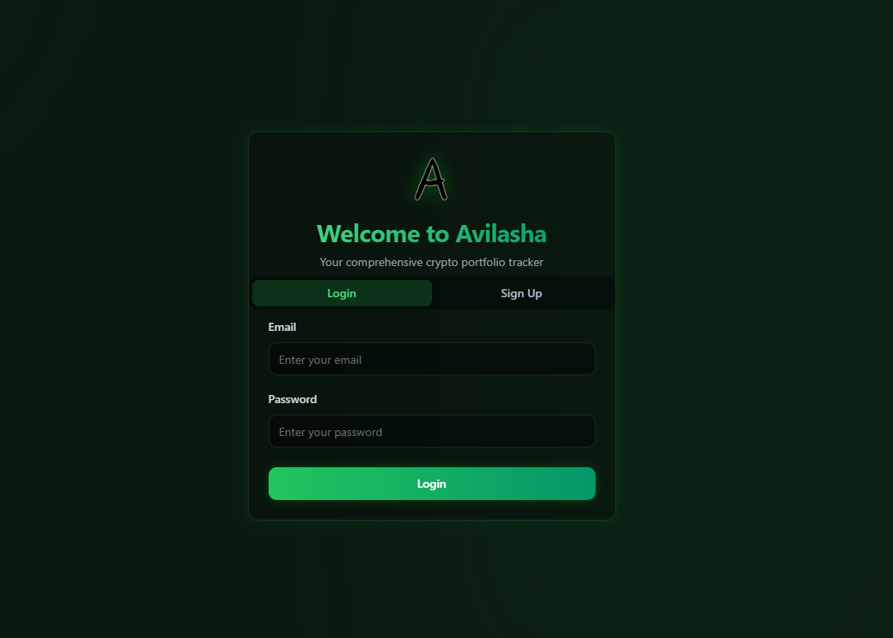
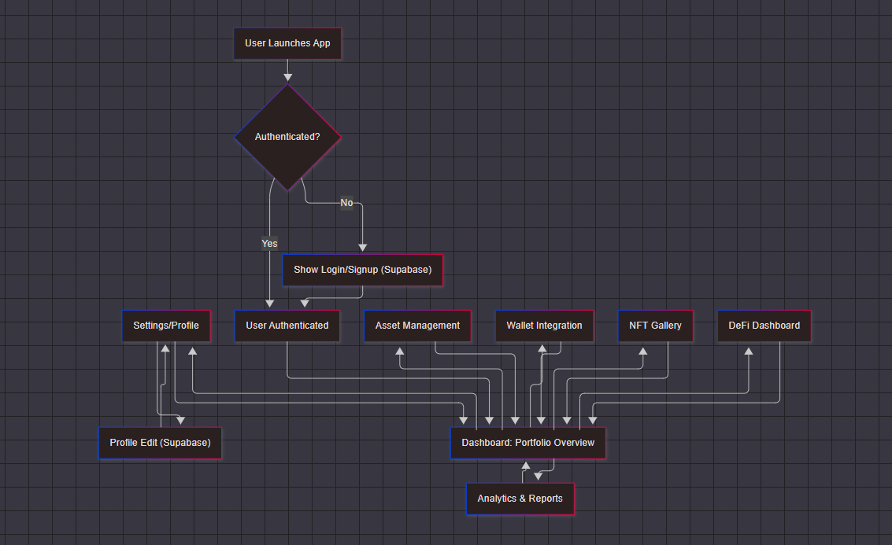

# Avilasha-2


Avilasha-2 is an Electron desktop application for cryptocurrency portfolio management and analytics. Built with React, TypeScript, and Vite, it offers a modern, responsive UI for managing crypto assets, wallets, and DeFi investments.

## 📸 Screenshots

<div align="center">
  
  
  <br/>
  
  
  <br/>
  
</div>

## ✨ Features

- **Portfolio Analytics**: Track and analyze your crypto portfolio performance
- **Market Analysis**: Real-time market data and trend analysis
- **Asset Management**: Manage your crypto assets in one place
- **Wallet Integration**: Connect and manage multiple crypto wallets
- **DeFi Dashboard**: Monitor your DeFi investments
- **NFT Gallery**: View and manage your NFT collection
- **Transaction History**: Complete record of your crypto transactions
- **Secure Storage**: Enhanced security for sensitive financial data

## 🚀 Real-Time Updates (2025)

- **Live Data Everywhere**: All major pages (Dashboard, Portfolio Analytics, Assets, Wallets, DeFi, NFTs, History, Alerts, News, Transfer) now update automatically every 15 seconds. No manual refresh needed—balances, transactions, market data, and analytics are always current.
- **How it Works**: Each page uses polling to fetch the latest data from APIs and services. For advanced users, polling intervals can be customized in the code.
- **Instant Feedback**: Actions like transfers, wallet changes, and alerts are reflected in the UI in real time.

## 🔄 Workflow



## 🔑 Authentication & Supabase Integration

- **Supabase Auth**: User authentication and session management are handled securely via [Supabase](https://supabase.com/).
- **User Profiles**: User profile data (full name, email, phone, avatar) is stored in the Supabase `profiles` table and editable within the app.
- **Session Security**: No sensitive tokens are stored in localStorage. Sessions are managed by Supabase and expired on logout/inactivity.

### Supabase Setup
1. Create a [Supabase](https://supabase.com/) project.
2. In your Supabase dashboard, create a `profiles` table with at least these columns:
   - `id` (UUID, primary key, references `auth.users.id`)
   - `full_name` (text)
   - `email` (text)
   - `phone` (text)
   - `avatar_url` (text, optional)
3. Get your Supabase URL and anon/public API key from Project Settings → API.
4. Add these to your `.env` or config files as shown in `src/services/supabaseClient.ts`.

## 🔄 Automated Release Notes

This project uses [Release Drafter](https://github.com/release-drafter/release-drafter) to automatically generate release notes for every GitHub release. To draft a release:
1. Go to the GitHub repo → Releases → Draft a new release → "Generate release notes".
2. Or, enable GitHub Actions to have drafts created automatically from PRs and commits.

## 🔐 Security

The application implements several security features:
- **Encryption**: AES-GCM encryption for sensitive data
- **Session Management**: Timeout for inactive users
- **Supabase**: All authentication and user data is securely managed by Supabase
- **Input Sanitization**: XSS attack prevention
- **Secure Storage**: No sensitive tokens stored in localStorage; only minimal session info is kept

## 💻 Technology Stack

- **Frontend**: React, TypeScript, TailwindCSS
- **UI Components**: Radix UI Components
- **Desktop Framework**: Electron
- **Build Tool**: Vite
- **Charts**: Recharts
- **State Management**: React Query, Context API

## 🚀 Installation

### Prerequisites

- Node.js 18+ and npm/yarn
- Git

### Getting Started

```sh
# Clone the repository
git clone https://github.com/prashantkandel55/Avilasha-2.git
cd Avilasha-2

# Install dependencies
npm install

# Run in development mode
npm run electron:dev

# Build for production
npm run electron:build

# Preview production build
npm run electron:preview
```

## 📦 Development Server

The development server runs on port 3001 (http://localhost:3001/).

## 🏗️ Project Structure

```
avilasha-2/
├── electron/                # Electron main process files
│   ├── main.js              # Main entry point for Electron
│   └── preload.js           # Preload script for IPC
├── src/                     # React application source code
│   ├── components/          # UI components
│   ├── services/            # Service modules
│   ├── pages/               # Application pages
│   ├── layouts/             # Layout components
│   ├── hooks/               # Custom React hooks
│   ├── types/               # TypeScript type definitions
│   └── App.tsx              # Main React component
├── public/                  # Static assets
└── docs/                    # Documentation and images
    └── images/              # Screenshots and images
```

## 🚀 Recent Updates (April 2025)

- **Logo Update**: Switched from PNG to modern SVG logo (`public/Avilasha.svg`) for sharper visuals and better scalability across all screens.
- **Settings Page Usability**: The Settings page is now always visible, even without a connected wallet. A warning banner and wallet connect prompt are shown if needed.
- **Social Login**: Added Google, X (Twitter), and GitHub login buttons to the Auth page for easier sign-up and sign-in.
- **UI Enhancements**: Improved fallback logic for logo display and made social login buttons visually appealing and accessible.
- **Clean Code**: Addressed lint errors and improved code structure for wallet and settings management.

## 🖼️ Logo Usage
- The SVG logo is loaded using a relative path (`Avilasha.svg`). Ensure the file is present in the `public` directory.
- If the logo fails to load, a fallback avatar or nothing is shown (depending on the page).

## 🛠️ How to Update/Run
1. Place `Avilasha.svg` in the `public` directory.
2. Start the app with `npm run dev` for development or `npm run build` for production.
3. Social login features require correct Supabase OAuth setup for Google, GitHub, and Twitter (X).

## 👥 Contributing

Contributions are welcome! Please feel free to submit a Pull Request.

1. Fork the repository
2. Create your feature branch (`git checkout -b feature/amazing-feature`)
3. Commit your changes (`git commit -m 'Add some amazing feature'`)
4. Push to the branch (`git push origin feature/amazing-feature`)
5. Open a Pull Request

## 📄 License

This project is licensed under the MIT License - see the LICENSE file for details.

## 📞 Contact

Prashant Kandel - [@prashantkandel55](https://github.com/prashantkandel55)

Project Link: [https://github.com/prashantkandel55/Avilasha-2](https://github.com/prashantkandel55/Avilasha-2)

## 🙏 Acknowledgements

- [Electron](https://www.electronjs.org/)
- [React](https://reactjs.org/)
- [Vite](https://vitejs.dev/)
- [Radix UI](https://www.radix-ui.com/)
- [TailwindCSS](https://tailwindcss.com/)
- [React Query](https://react-query.tanstack.com/)
- [Recharts](https://recharts.org/)
