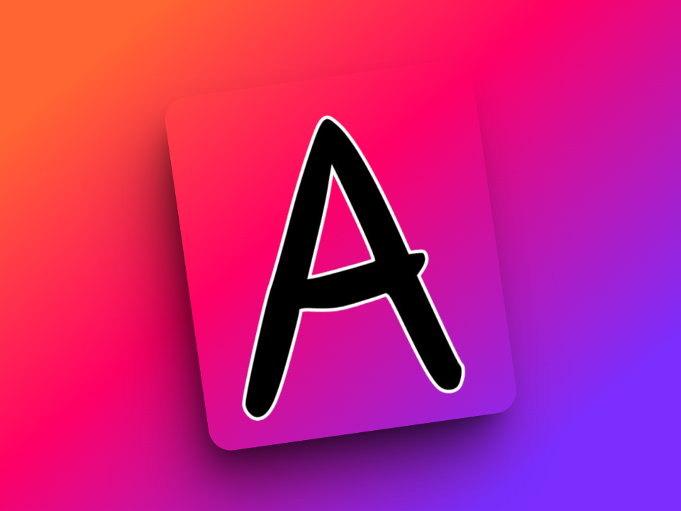

# Avilasha-2



Avilasha-2 is an Electron desktop application for cryptocurrency portfolio management and analytics. Built with React, TypeScript, and Vite, it offers a modern, responsive UI for managing crypto assets, wallets, and DeFi investments.

## 📸 Screenshots

<div align="center">
  
  
  <br/>
  
  
</div>

## ✨ Features

- **Portfolio Analytics**: Track and analyze your crypto portfolio performance
- **Market Analysis**: Real-time market data and trend analysis
- **Asset Management**: Manage your crypto assets in one place
- **Wallet Integration**: Connect and manage multiple crypto wallets
- **DeFi Dashboard**: Monitor your DeFi investments
- **NFT Gallery**: View and manage your NFT collection
- **Transaction History**: Complete record of your crypto transactions
- **Secure Storage**: Enhanced security for sensitive financial data

## 💻 Technology Stack

- **Frontend**: React, TypeScript, TailwindCSS
- **UI Components**: Radix UI Components
- **Desktop Framework**: Electron
- **Build Tool**: Vite
- **Authentication**: JWT-based authentication
- **Encryption**: AES-GCM for sensitive data
- **Charts**: Recharts
- **State Management**: React Query, Context API

## 🚀 Installation

### Prerequisites

- Node.js 18+ and npm/yarn
- Git

### Getting Started

```sh
# Clone the repository
git clone https://github.com/prashantkandel55/Avilasha-2.git
cd Avilasha-2

# Install dependencies
npm install

# Run in development mode
npm run electron:dev

# Build for production
npm run electron:build

# Preview production build
npm run electron:preview
```

## 📦 Development Server

The development server runs on port 3001 (http://localhost:3001/).

## 🏗️ Project Structure

```
avilasha-2/
├── electron/                # Electron main process files
│   ├── main.js              # Main entry point for Electron
│   └── preload.js           # Preload script for IPC
├── src/                     # React application source code
│   ├── components/          # UI components
│   ├── services/            # Service modules
│   ├── pages/               # Application pages
│   ├── layouts/             # Layout components
│   ├── hooks/               # Custom React hooks
│   ├── types/               # TypeScript type definitions
│   └── App.tsx              # Main React component
├── public/                  # Static assets
└── docs/                    # Documentation and images
    └── images/              # Screenshots and images
```

## 🔐 Security

The application implements several security features:
- **Encryption**: AES-GCM encryption for sensitive data
- **Session Management**: Timeout for inactive users
- **Rate Limiting**: Protection against API abuse
- **Input Sanitization**: XSS attack prevention
- **Secure Storage**: Protected local storage for credentials

## 🔄 Workflow


### User Experience Flow

1. **Authentication**: Secure login with multi-factor authentication
2. **Dashboard**: Overview of portfolio performance
3. **Asset Management**: Add, remove, and track crypto assets
4. **Analytics**: Detailed portfolio analytics
5. **Wallets**: Integration with multiple crypto wallets
6. **Settings**: Customize your experience

## 👥 Contributing

Contributions are welcome! Please feel free to submit a Pull Request.

1. Fork the repository
2. Create your feature branch (`git checkout -b feature/amazing-feature`)
3. Commit your changes (`git commit -m 'Add some amazing feature'`)
4. Push to the branch (`git push origin feature/amazing-feature`)
5. Open a Pull Request

## 📄 License

This project is licensed under the MIT License - see the LICENSE file for details.

## 📞 Contact

Prashant Kandel - [@prashantkandel55](https://github.com/prashantkandel55)

Project Link: [https://github.com/prashantkandel55/Avilasha-2](https://github.com/prashantkandel55/Avilasha-2)

## 🙏 Acknowledgements

- [Electron](https://www.electronjs.org/)
- [React](https://reactjs.org/)
- [Vite](https://vitejs.dev/)
- [Radix UI](https://www.radix-ui.com/)
- [TailwindCSS](https://tailwindcss.com/)
- [React Query](https://react-query.tanstack.com/)
- [Recharts](https://recharts.org/)
